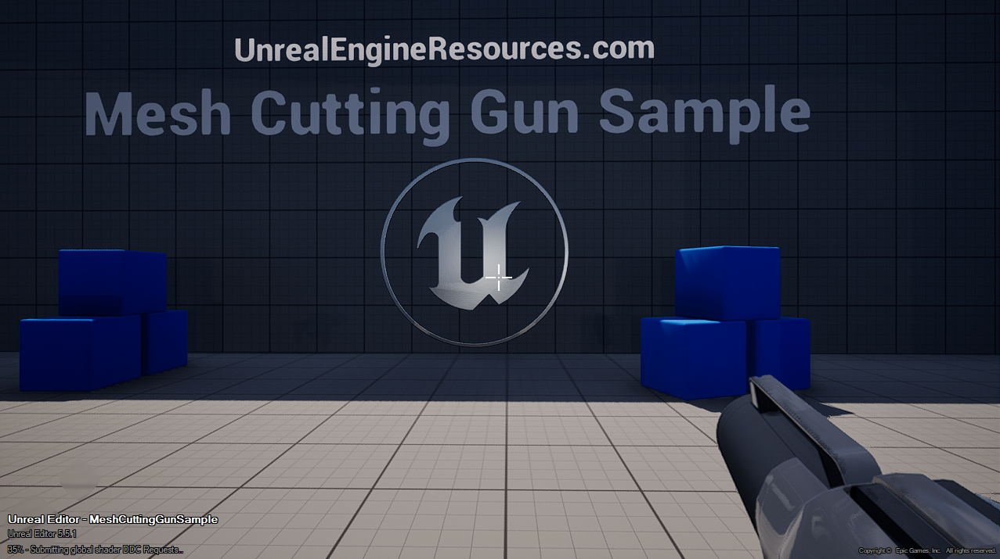

https://unrealengineresources.com/

# Mesh Cutting Gun Sample

## Quick Overview :
The sample provides two main interaction Mechanics :
- Physics Grabbing
- Mesh Cutting / Restoring

## Inputs :
#### Character :
- WASD : Movement
- Space Bar : Jump

#### Weapon :
- Left Mouse Button : Shoot Projectile

#### Interaction (Shared) :
- Right Mouse Button (Pressed) : Start Interaction 
- Right Mouse Button (Released) : End Interaction 
- Middle Mouse Button : Cancel Interaction 

#### Mesh Cut Interaction :
- Tab : Switch Cut Shapes
- Mouse Wheel : Modify cutting shape width

## More documentation coming soon... :) 
